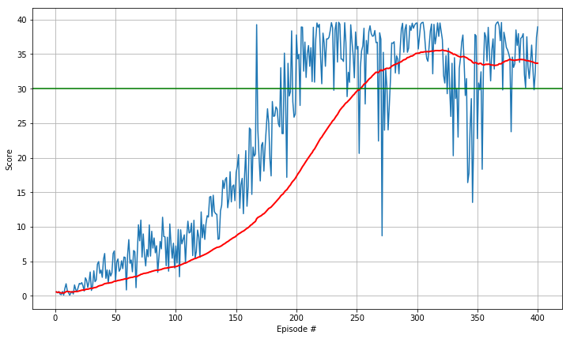

# Report for Continuous Control problem

The environment of the provided solution is for a single instance of a double-jointed arm can that move to target locations.

The selected algorithm is a DDPG (Deep Deterministic  Policy Gradient) one. Its advantage is the ability to operate continuously. 

After installing the environment the user can run through the notebook, `DDPG.ipynb` where implementation details, the training of the agent and the testing are described. 

## Structure
Two files, located in the `code` folder are imported for the solution, the `model.py` and the `ddpg.py`. 

### Models
The Neural Network models for the Actor and the Critic are 2-hidden layer fully connected layer neural networks, consisting of `384` and `256` units respectively. The output layer for the actor is `tanh` and the outputs are clipped in the range `[-1, +1]`. Other values can also achieve the result therefore there is a wide range of number to try. The sampling process has been changes to normal distribution instead of uniform. 

### Agent
The agent consists of an actor and a critic, both of which are implemented as `Q` networks with local and target networks. 

The noise process is a `Ornstein-Uhlenbeck` one where the σ value has been changed and proved during the training to be an important parameter to achieve solution. 

### Hyperparameters

| Name        | Value |
|-------------|-------|
| BUFFER_SIZE | 1e5   |
| BATCH_SIZE  | 256   |
| GAMMA       | 0.99  |
| TAU         | 1e-3  |
| LR_ACTOR    | 3e-5  |
| LR_CRITIC   | 1e-4  |
| NOISE σ     | 0.03  |

## Training
The agent is trained and the purpose is to reach an average reqard over last 100 samples of +30 or more. The desired result is achieved after 254 episodes, as shown in the plot. 

The final result are saved in the `checkpoints` folder.

## Future ideas
The agent achieves the required performance but I certainly believe there is room for improvement to achieve it faster. Changing the noise parameter was important to determine the performance. So wht some further similations, more optimal convergence can be achieved.
Also, tweaking the various other parameters such as learning rates, or the network hidded units and even the layers can have an effect. 

Moreover, other continuous actions approaches different from DDPG such as PPO would be interesting to try. 
